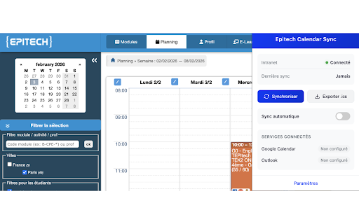

# Epitech Calendar Sync

Extension navigateur (Chrome/Firefox) qui synchronise le calendrier de l'intranet Epitech vers Google Calendar, Outlook, ou export fichier .ics.



## Fonctionnalités

- **Synchronisation automatique** : Sync le calendrier à chaque visite de l'intranet ou 1x par jour
- **Export ICS** : Télécharge un fichier .ics compatible avec Apple Calendar et autres
- **Google Calendar** : Synchronisation bidirectionnelle avec création/mise à jour/suppression
- **Outlook Calendar** : Synchronisation via Microsoft Graph API
- **Interface intuitive** : Popup de contrôle rapide + page de paramètres complète

## Installation

### Mode développeur (Chrome)

1. Clonez ce dépôt
2. Installez les dépendances :
   ```bash
   npm install
   ```
3. Compilez l'extension :
   ```bash
   npm run build
   ```
4. Ouvrez Chrome et allez dans `chrome://extensions/`
5. Activez le "Mode développeur"
6. Cliquez sur "Charger l'extension non empaquetée"
7. Sélectionnez le dossier `dist/`

### Mode développeur (Firefox)

1. Suivez les étapes 1-3 ci-dessus
2. Ouvrez Firefox et allez dans `about:debugging`
3. Cliquez sur "Ce Firefox"
4. Cliquez sur "Charger un module temporaire"
5. Sélectionnez le fichier `dist/manifest.json`

## Configuration

### Période de synchronisation

- **Date de début** : Aujourd'hui ou date personnalisée
- **Date de fin** : +1, +6, ou +12 mois

### Services

#### Google Calendar

1. Activez Google Calendar dans les paramètres
2. Cliquez sur "Connecter"
3. Autorisez l'accès à votre calendrier
4. Un calendrier "Epitech" sera créé automatiquement

#### Outlook Calendar

1. Activez Outlook Calendar dans les paramètres
2. Cliquez sur "Connecter"
3. Connectez-vous avec votre compte Microsoft
4. Un calendrier "Epitech" sera créé automatiquement

#### Export ICS

L'export ICS est activé par défaut. Cliquez sur "Exporter .ics" dans le popup pour télécharger le fichier.

## Développement

```bash
# Installer les dépendances
npm install

# Mode développement avec hot reload
npm run dev

# Build de production
npm run build

# Vérification TypeScript
npm run typecheck

# Linting
npm run lint
```

## Structure du projet

```
epitech-calendar-sync/
├── src/
│   ├── manifest.json           # Manifest V3
│   ├── background/             # Service worker
│   │   ├── index.ts
│   │   ├── sync-manager.ts
│   │   └── epitech-api.ts
│   ├── content/                # Content script
│   │   └── detector.ts
│   ├── popup/                  # Interface popup
│   │   ├── index.html
│   │   ├── popup.ts
│   │   └── popup.css
│   ├── options/                # Page de paramètres
│   │   ├── index.html
│   │   ├── options.ts
│   │   └── options.css
│   ├── services/               # Services calendrier
│   │   ├── ics-generator.ts
│   │   ├── google-calendar.ts
│   │   └── outlook-calendar.ts
│   ├── storage/                # Gestion du stockage
│   │   └── settings.ts
│   ├── types/                  # Types TypeScript
│   │   ├── epitech.ts
│   │   └── settings.ts
│   └── utils/                  # Utilitaires
│       └── date.ts
├── assets/icons/               # Icônes de l'extension
├── scripts/                    # Scripts utilitaires
├── package.json
├── tsconfig.json
└── vite.config.ts
```

## Publication sur les stores

### Chrome Web Store

```bash
# 1. Build
npm run build

# 2. Créer le ZIP
cd dist && zip -r ../epitech-calendar-sync-chrome.zip .
```

Upload `epitech-calendar-sync-chrome.zip` sur https://chrome.google.com/webstore/devconsole

### Firefox Add-ons

```bash
# 1. Build
npm run build

# 2. Remplacer le manifest par la version Firefox
cp src/manifest.firefox.json dist/manifest.json

# 3. Créer le ZIP de l'extension
cd dist && zip -r ../epitech-calendar-sync-firefox.zip .

# 4. Créer le ZIP du code source (requis par Firefox)
cd .. && zip -r epitech-calendar-sync-source.zip . -x "node_modules/*" -x "dist/*" -x ".git/*" -x "*.zip" -x ".DS_Store"
```

Upload les deux ZIPs sur https://addons.mozilla.org/developers/

> **Note Firefox** : Google Calendar et Outlook ne sont pas disponibles sur Firefox (API `identity` non supportée). Seul l'export ICS fonctionne.

## Configuration OAuth (pour la publication)

### Google Calendar

1. Créez un projet sur [Google Cloud Console](https://console.cloud.google.com/)
2. Activez l'API Google Calendar
3. Créez des identifiants OAuth 2.0
4. Ajoutez l'ID client dans `src/manifest.json` (`oauth2.client_id`)

### Outlook Calendar

1. Enregistrez une application sur [Azure Portal](https://portal.azure.com/)
2. Configurez les permissions Calendar.ReadWrite
3. Ajoutez l'ID client dans `src/services/outlook-calendar.ts` (`MS_CLIENT_ID`)

## Notes techniques

- L'extension utilise la session authentifiée de l'utilisateur sur `intra.epitech.eu`
- Les dates sont en timezone Europe/Paris
- Les événements sont identifiés par UID unique (`epitech-{codeacti}-{codeevent}@epitech.eu`)
- Rate limiting : 1 sync par visite ou par jour selon la configuration

## Licence

MIT
